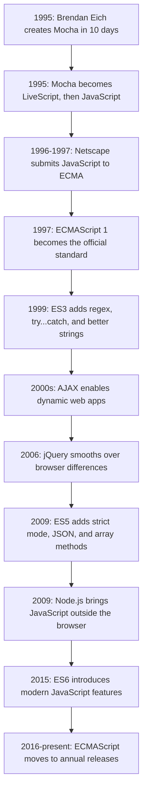

# History of JavaScript

Understanding JavaScript's history helps explain why the language has some unusual names, quirks, and design choices. JavaScript was created quickly, shaped by browser competition, standardized under a different official name, and eventually grew far beyond the browser.

## The 10-Day Miracle

JavaScript was created in 1995 by **Brendan Eich**, a programmer at Netscape Communications. Netscape wanted a lightweight scripting language that could make web pages interactive without needing a full page reload or a heavier language like Java or C++.

The first version was built in just **10 days** in May 1995. That speed is impressive, but it also helps explain why early JavaScript had rough edges that the language has been improving ever since.

The name also changed several times:

1. It started as **Mocha**.
2. It was renamed **LiveScript**.
3. It became **JavaScript** as a marketing move, because Java was extremely popular at the time.

Despite the name, **JavaScript and Java are different languages**. They have different runtimes, use cases, and design goals. The connection was mostly branding.

## Browser Wars and Standardization

As the web grew, Microsoft created its own JavaScript-like language called **JScript** for Internet Explorer. This started a period known as the **Browser Wars**, where developers often had to write different code for different browsers.

To prevent the web from splitting into incompatible versions, Netscape submitted JavaScript to **ECMA International** in 1996. In 1997, the first official standard was published as **ECMAScript 1 (ES1)**.

This is why you still hear two names:

- **ECMAScript** is the official language standard.
- **JavaScript** is the most widely used implementation of that standard.

In 1999, **ECMAScript 3 (ES3)** added important features such as regular expressions, `try...catch`, and improved string handling. ES3 became stable and widely supported, which is one reason the next major update took many years.

## AJAX and jQuery

In the mid-2000s, developers began using JavaScript to fetch data from servers in the background without reloading the whole page. This technique became known as **AJAX**: Asynchronous JavaScript and XML.

AJAX made web applications feel much more dynamic. Apps like Gmail and Google Maps showed that the browser could behave more like a full application platform, not just a document viewer.

Browser differences were still painful, so **John Resig** created **jQuery** in 2006. jQuery provided a simpler and more consistent API for selecting elements, handling events, and making AJAX requests. For many years, it was one of the most common libraries on the web.

## The Game Changers of 2009

The year 2009 was a major turning point for JavaScript.

**ECMAScript 5 (ES5)** added features that made the language more practical and reliable, including:

- Strict mode with `"use strict"`
- Native JSON support
- Array methods like `.map()`, `.filter()`, and `.reduce()`

The same year, **Ryan Dahl** created **Node.js** by taking Chrome's V8 JavaScript engine and making it run outside the browser. This allowed JavaScript to run on servers, command-line tools, build systems, and more.

Node.js changed JavaScript's role. Developers could now use JavaScript across the full stack: frontend and backend.

## ES6 and the Modern Language

After years of slow progress and failed proposals, the standards committee **TC39** released **ECMAScript 2015**, commonly called **ES6**.

ES6 was the biggest update in JavaScript history. It introduced features that modern JavaScript developers use every day:

- `let` and `const`
- Arrow functions: `() => {}`
- Classes
- Modules with `import` and `export`
- Template literals: `` `Hello ${name}` ``
- Promises for cleaner asynchronous code

ES6 made JavaScript feel more modern, structured, and scalable.

## Annual Releases

After ES6, TC39 moved to a yearly release cycle. Instead of waiting many years for huge updates, JavaScript now receives smaller improvements every year.

Recent additions include:

- `async` and `await` in ES2017
- Optional chaining `?.` and nullish coalescing `??` in ES2020
- `Array.prototype.at()` and `Object.hasOwn()` in ES2022

Today, JavaScript powers websites, servers, mobile apps with React Native, desktop apps with Electron, browser extensions, build tools, and even AI-powered applications.

## JavaScript History Flow

