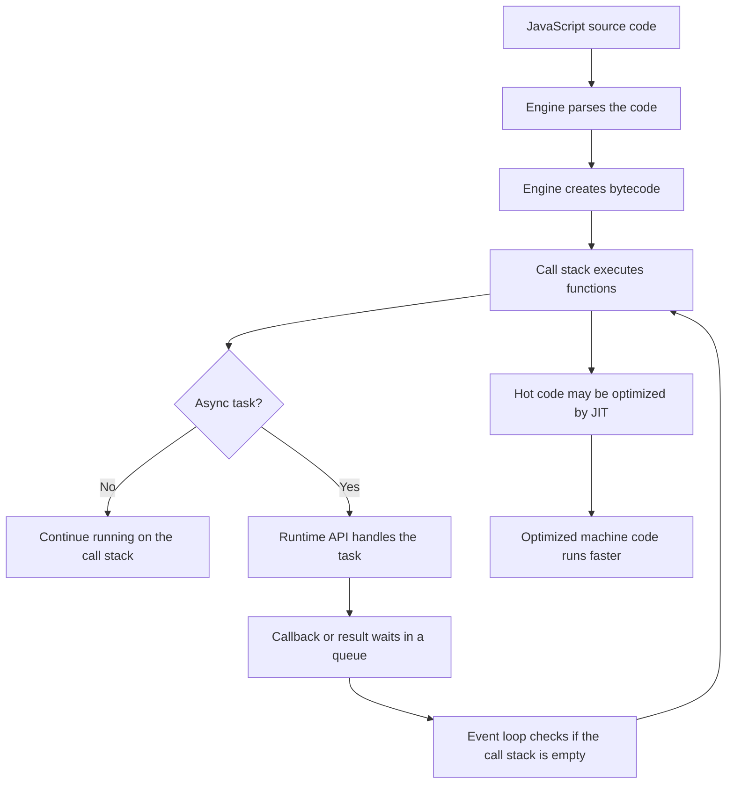

# How JavaScript Runs

To truly understand JavaScript, it helps to know what happens after you write code and hit "run." JavaScript is often described as an interpreted language, but modern JavaScript engines do much more than simply read code line by line.

Today, JavaScript is parsed, compiled to internal bytecode, interpreted, optimized, and sometimes compiled again into highly efficient machine code while the program is running.

## The JavaScript Engine

At the center of JavaScript execution is the **JavaScript engine**. The engine reads your JavaScript code and turns it into instructions your computer can execute.

Different environments use different engines:

- **V8**: Used in Chrome, Node.js, Edge, and Opera
- **SpiderMonkey**: Used in Firefox
- **JavaScriptCore**: Used in Safari

Even though these engines are built by different teams, they all follow the **ECMAScript** standard. That is why the same JavaScript code usually behaves consistently across browsers and runtimes.

## What Happens Inside the Engine?

When a JavaScript engine receives your code, it goes through several steps.

1. **Parsing**: The engine reads the source code and checks whether the syntax is valid.
2. **Compilation to bytecode**: The code is converted into a lower-level internal format that the engine can execute.
3. **Execution**: The engine runs the bytecode using the call stack.
4. **Optimization**: If some code runs many times, the engine may optimize it with Just-In-Time compilation.

This is why modern JavaScript can be both flexible and fast.

## Memory Heap and Call Stack

Two important ideas help explain how JavaScript manages data and execution.

### Memory Heap

The **memory heap** is where JavaScript stores data that needs memory, especially objects, arrays, and functions.

Think of the heap like a large storage area. When you create an object, JavaScript needs somewhere to keep that object so your program can use it later.

```js
const user = {
  name: "Asha",
  role: "developer"
};
```

The `user` object lives in memory so JavaScript can read and update it while the program runs.

### Call Stack

The **call stack** keeps track of which function is currently running.

Think of it like a stack of plates:

- When a function is called, it is pushed onto the top of the stack.
- When the function finishes, it is popped off the stack.
- JavaScript always works on the function at the top.

```js
function greet() {
  console.log("Hello!");
}

function start() {
  greet();
}

start();
```

In this example, `start()` goes onto the stack first. Then `greet()` goes on top of it. When `greet()` finishes, it is removed, and then `start()` finishes.

## Just-In-Time Compilation

Early JavaScript engines were much simpler. They interpreted code as it ran, which made JavaScript flexible but not always fast.

Modern engines use **Just-In-Time (JIT) compilation**. This means the engine can compile JavaScript into machine code while the program is running.

The engine watches how your code behaves. If a function runs repeatedly, the engine may decide it is "hot" and optimize it. This lets JavaScript keep the flexibility of an interpreted language while gaining some of the speed benefits of compiled languages.

## JavaScript Is Single-Threaded

JavaScript has **one main call stack**, so it runs one piece of JavaScript code at a time.

This is what people mean when they say JavaScript is **single-threaded**.

If a function blocks the call stack for a long time, the page cannot respond during that time:

```js
while (true) {
  // This blocks the call stack forever.
}
```

That code prevents clicks, timers, rendering updates, and other JavaScript from running because the stack never becomes free.

So how can JavaScript handle timers, network requests, file reads, and user events without freezing everything? The answer is the **runtime environment**.

## The Runtime Environment

The JavaScript engine only runs JavaScript. It does not know how to display a webpage, make an HTTP request, read a file, or wait for a timer by itself.

Those abilities come from the **runtime environment**.

### In the Browser

The browser provides **Web APIs**, such as:

- `setTimeout`
- `fetch`
- `document`
- `window`
- DOM events like clicks and key presses

### In Node.js

Node.js provides its own APIs, such as:

- `fs` for working with files
- `http` for creating servers
- `process` for information about the running program

The runtime handles work outside the call stack. When that work finishes, its callback or continuation waits in a queue until JavaScript is ready to run it.

## How Async Work Runs

When JavaScript starts an asynchronous task, the engine does not keep the call stack blocked while waiting.

For example:

```js
console.log("Start");

setTimeout(() => {
  console.log("Timer done");
}, 1000);

console.log("End");
```

The output is:

```text
Start
End
Timer done
```

Here is what happens:

1. `console.log("Start")` runs immediately.
2. `setTimeout` is handed to the browser runtime.
3. JavaScript continues and runs `console.log("End")`.
4. After the timer finishes, the callback waits in a queue.
5. The event loop moves the callback back to the call stack when the stack is empty.

You will learn the event loop in more depth later, but for now remember this: **the runtime handles waiting, and the call stack handles running JavaScript code**.

## JavaScript Execution Flow



## Summary

JavaScript runs through a partnership between the engine and the runtime environment.

1. You write JavaScript source code.
2. The JavaScript engine parses and compiles it into internal bytecode.
3. Data is stored in memory, especially in the heap.
4. Functions run on the call stack, one at a time.
5. Modern engines use JIT compilation to optimize frequently used code.
6. Browser or Node.js APIs handle tasks like timers, network requests, files, and events.
7. The event loop coordinates when queued callbacks can return to the call stack.

:::quiz
question: Why can JavaScript handle a timer or network request without blocking the call stack?
options:
  - The JavaScript engine creates a new call stack for every async task
  - The runtime environment handles the waiting work and queues the callback for later
  - JavaScript stops executing all code until the task finishes
  - The memory heap executes async tasks in parallel
answer: 1
explanation: Async work such as timers and network requests is handled by the browser or Node.js runtime. When the work is ready, its callback waits in a queue until the call stack is empty.
:::